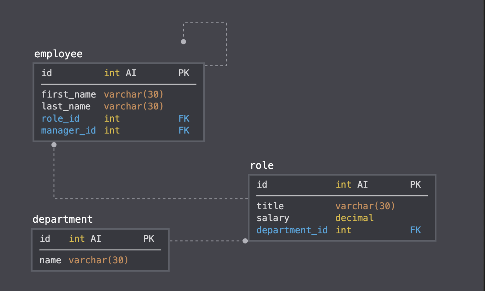

# week-12_Employee_Tracker



# Employee Tracker Application
[](https://github.com/carolninganga@gmail.com/employee-tracker-application)

## Description

A command-line application that at a minimum allows the user to:
Add departments, roles, employees
View departments, roles, employees
Update employee roles

## Table of Contents 

* [Installation](#installation)

* [Usage](#usage)

* [License](#license)

* [Contributing](#contributing)

* [Tests](#tests)

* [Questions](#questions)

## Installation

To install necessary dependencies, run the following command:

```
npm i
```

## Usage

This application requires a connection to MYSQL database. The user also has to make sure the packages of mysql and inquirer installed as dependencies to run the application.

## License

This project is licensed under the APACHE 2.0 license.
  
## Contributing


## Tests

To run tests, run the following command:

```
npm test
```

## Questions

If you have any questions about the repo, open an issue or contact [carolninganga@gmail.com] directly at carolninganga@gmail.com.

